## 一. 网卡相关信息

1. 网卡：Realtek RTL8187

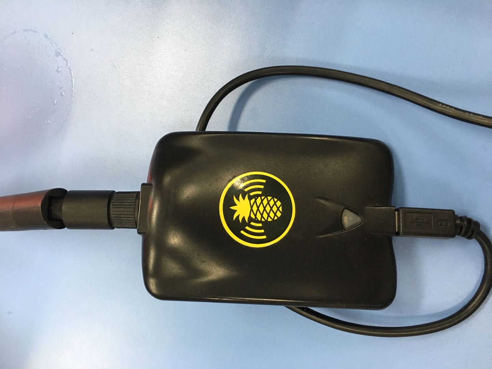

2. 网卡的参数


```
$ iw phy

```


``` bash
Wiphy phy0
	max # scan SSIDs: 4
	max scan IEs length: 2285 bytes
	max # sched scan SSIDs: 0
	max # match sets: 0
	max # scan plans: 1
	max scan plan interval: -1
	max scan plan iterations: 0
	Retry short limit: 7
	Retry long limit: 4
	Coverage class: 0 (up to 0m)
	Device supports RSN-IBSS.
	Supported Ciphers:
		* WEP40 (00-0f-ac:1)
		* WEP104 (00-0f-ac:5)
		* TKIP (00-0f-ac:2)
		* CCMP-128 (00-0f-ac:4)
		* CCMP-256 (00-0f-ac:10)
		* GCMP-128 (00-0f-ac:8)
		* GCMP-256 (00-0f-ac:9)
	Available Antennas: TX 0 RX 0
	Supported interface modes:
		 * IBSS
		 * managed
		 * monitor
	Band 1:
		Bitrates (non-HT):
			* 1.0 Mbps
			* 2.0 Mbps
			* 5.5 Mbps
			* 11.0 Mbps
			* 6.0 Mbps
			* 9.0 Mbps
			* 12.0 Mbps
			* 18.0 Mbps
			* 24.0 Mbps
			* 36.0 Mbps
			* 48.0 Mbps
			* 54.0 Mbps
		Frequencies:
			* 2412 MHz [1] (20.0 dBm)
			* 2417 MHz [2] (20.0 dBm)
			* 2422 MHz [3] (20.0 dBm)
			* 2427 MHz [4] (20.0 dBm)
			* 2432 MHz [5] (20.0 dBm)
			* 2437 MHz [6] (20.0 dBm)
			* 2442 MHz [7] (20.0 dBm)
			* 2447 MHz [8] (20.0 dBm)
			* 2452 MHz [9] (20.0 dBm)
			* 2457 MHz [10] (20.0 dBm)
			* 2462 MHz [11] (20.0 dBm)
			* 2467 MHz [12] (20.0 dBm) (no IR)
			* 2472 MHz [13] (20.0 dBm) (no IR)
			* 2484 MHz [14] (20.0 dBm) (no IR)
	Supported commands:
		 * new_interface
		 * set_interface
		 * new_key
		 * start_ap
		 * new_station
		 * new_mpath
		 * set_mesh_config
		 * set_bss
		 * authenticate
		 * associate
		 * deauthenticate
		 * disassociate
		 * join_ibss
		 * join_mesh
		 * set_tx_bitrate_mask
		 * frame
		 * frame_wait_cancel
		 * set_wiphy_netns
		 * set_channel
		 * set_wds_peer
		 * probe_client
		 * set_noack_map
		 * register_beacons
		 * start_p2p_device
		 * set_mcast_rate
		 * connect
		 * disconnect
		 * set_qos_map
		 * set_multicast_to_unicast
	Supported TX frame types:
		 * IBSS: 0x00 0x10 0x20 0x30 0x40 0x50 0x60 0x70 0x80 0x90 0xa0 0xb0 0xc0 0xd0 0xe0 0xf0
		 * managed: 0x00 0x10 0x20 0x30 0x40 0x50 0x60 0x70 0x80 0x90 0xa0 0xb0 0xc0 0xd0 0xe0 0xf0
		 * AP: 0x00 0x10 0x20 0x30 0x40 0x50 0x60 0x70 0x80 0x90 0xa0 0xb0 0xc0 0xd0 0xe0 0xf0
		 * AP/VLAN: 0x00 0x10 0x20 0x30 0x40 0x50 0x60 0x70 0x80 0x90 0xa0 0xb0 0xc0 0xd0 0xe0 0xf0
		 * mesh point: 0x00 0x10 0x20 0x30 0x40 0x50 0x60 0x70 0x80 0x90 0xa0 0xb0 0xc0 0xd0 0xe0 0xf0
		 * P2P-client: 0x00 0x10 0x20 0x30 0x40 0x50 0x60 0x70 0x80 0x90 0xa0 0xb0 0xc0 0xd0 0xe0 0xf0
		 * P2P-GO: 0x00 0x10 0x20 0x30 0x40 0x50 0x60 0x70 0x80 0x90 0xa0 0xb0 0xc0 0xd0 0xe0 0xf0
		 * P2P-device: 0x00 0x10 0x20 0x30 0x40 0x50 0x60 0x70 0x80 0x90 0xa0 0xb0 0xc0 0xd0 0xe0 0xf0
	Supported RX frame types:
		 * IBSS: 0x40 0xb0 0xc0 0xd0
		 * managed: 0x40 0xd0
		 * AP: 0x00 0x20 0x40 0xa0 0xb0 0xc0 0xd0
		 * AP/VLAN: 0x00 0x20 0x40 0xa0 0xb0 0xc0 0xd0
		 * mesh point: 0xb0 0xc0 0xd0
		 * P2P-client: 0x40 0xd0
		 * P2P-GO: 0x00 0x20 0x40 0xa0 0xb0 0xc0 0xd0
		 * P2P-device: 0x40 0xd0
	software interface modes (can always be added):
		 * monitor
	interface combinations are not supported
	HT Capability overrides:
		 * MCS: ff ff ff ff ff ff ff ff ff ff
		 * maximum A-MSDU length
		 * supported channel width
		 * short GI for 40 MHz
		 * max A-MPDU length exponent
		 * min MPDU start spacing
	Device supports TX status socket option.
	Device supports HT-IBSS.
	Device supports SAE with AUTHENTICATE command
	Device supports low priority scan.
	Device supports scan flush.
	Device supports AP scan.
	Device supports per-vif TX power setting
	Driver supports full state transitions for AP/GO clients
	Driver supports a userspace MPM
	Device supports configuring vdev MAC-addr on create.


```
## 二. 实验过程

1. 查看无线网卡参数配置,确保无线网卡的工作模式是managed，且Access Poit值为Not-Associated.

``` bash
$ iwconfig

```

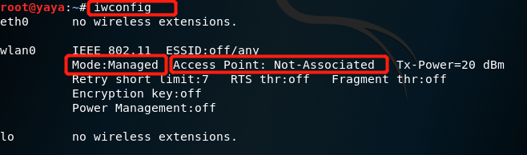


2. 仅查看附近无线网络的SSID

``` bash
$ iw dev wlan0 scan | grep SSID

```

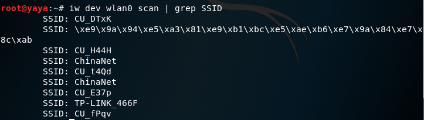

3. 自动处理UTF-8编码的SSID名称。

``` bash

$ iw dev wlan0 scan | grep SSID | xargs -0 echo -e

```
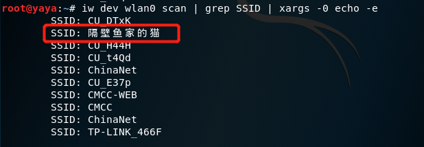

4. 开启网卡的监听模式。


``` bash
# 解决部分无线网卡在Kali 2.0系统中设置监听模式失败，杀死可能会导致aircrack-ng套件工作异常的相关进程

$ airmon-ng check kill

# 设置wlan0工作在监听模式

$ airmon-ng start wlan0


```
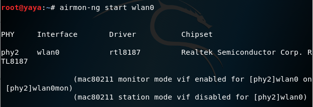


5. 开始抓包。


``` bash

$ airodump-ng wlan0mon

```

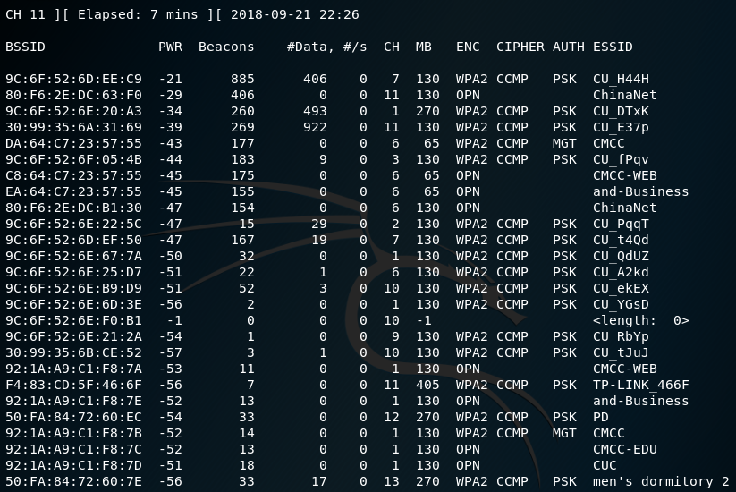

- 命令行模式的键盘交互快捷键

  - -a
  
  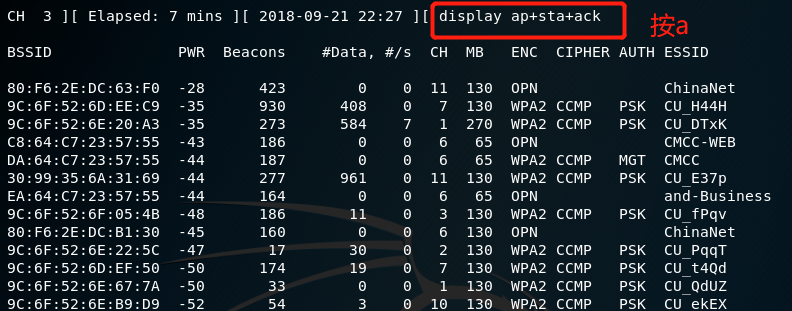 

  - -d
  
  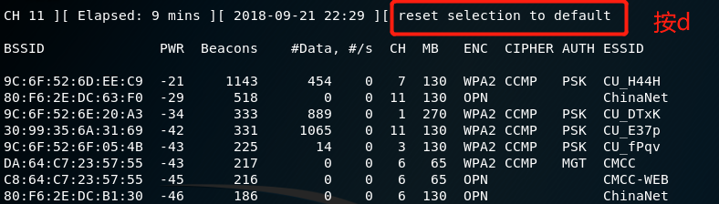

  - -m
  
  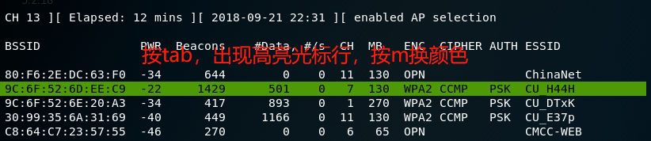

6. 将抓包结果保存到文件.（这里没有指定具体的信道）

``` bash

$ airodump-ng wlan0mon -w 20180922 --beacons 


# 查看以保存的文件

$ ls -l

```
  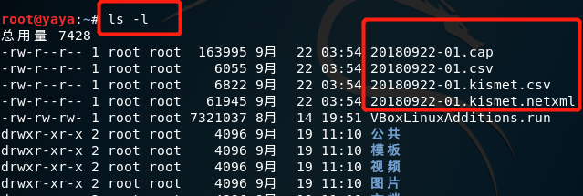

7. 分析抓到的包。


``` bash

$ wireshark 20180922-01.cap 

```

  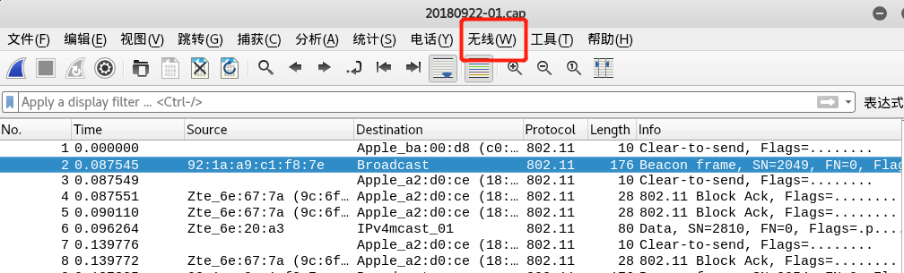


8. 按照上图所示选择：*无线-> WLAN流量*，可以看到无线包。

  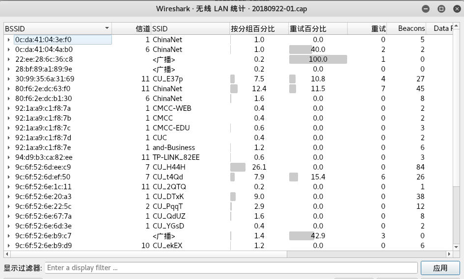


## 三. 数据包的统计

这次实验我在不同时间，不同地点抓取了两个数据包进行数据分析,一个是20180922-01.cap，一个是20180923-03.cap，这样可以使实验结果更全面。

#### 1. 20180922-01.cap

  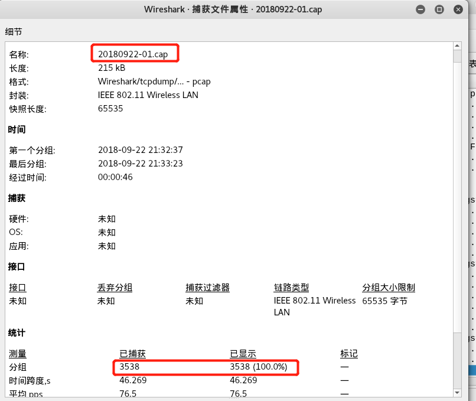
  
- 一共抓取了3538个包

#### 2. 20180923-03.cap
  
  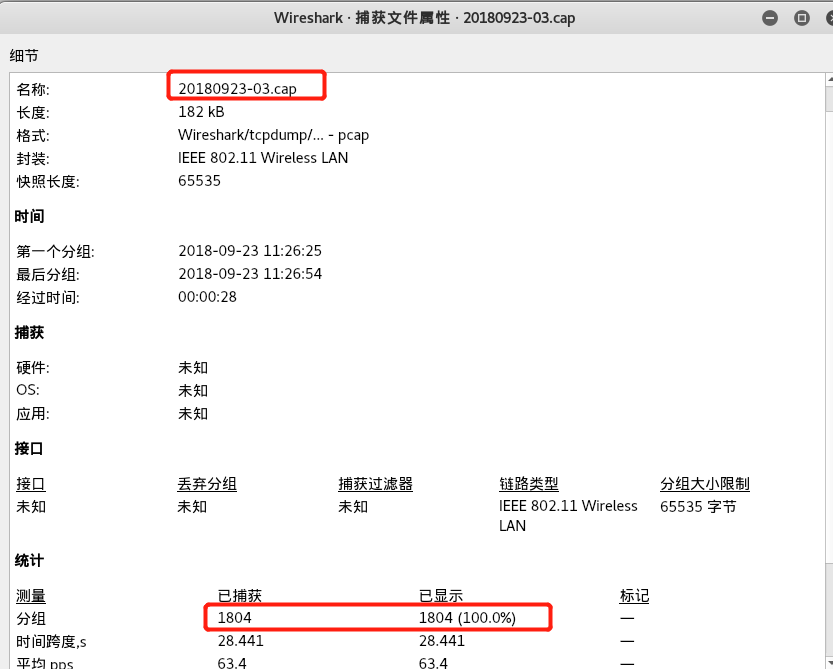
  
- 一共抓取了1804个包


## 四. 实验问题及解答

#### 1. 查看统计当前信号覆盖范围内一共有多少独立的SSID？其中是否包括隐藏SSID？

- 广播了Beacon Frame的AP的SSID是独立的SSID。

``` bash

# -Y是过滤条件，0x08是Beacon帧类型。
# -T是输出格式，选择fields可以控制输出哪些域。
# -e是控制输出哪些域，这里选择输出sa和ssid。
# cat -v是为了用可打印字符来表示不可打印字符，进而将不可打印字符与空进行区分。
# sort -u是为了去重。

$ tshark -r 20180922-01.cap -Y wlan.fc.type_subtype==0x08 -T fields -e wlan.sa -e wlan.ssid | sort -u | cat -v  > beacon01.list

$ tshark -r 20180923-03.cap -Y wlan.fc.type_subtype==0x08 -T fields -e wlan.sa -e wlan.ssid | sort -u | cat -v  > beacon03.list

```
   1. beacon01.list

``` bash
0c:da:41:04:3e:f0	ChinaNet
0c:da:41:04:4a:b0	ChinaNet
30:99:35:6a:31:69	CU_E37p
80:f6:2e:dc:63:f0	ChinaNet
80:f6:2e:dc:b1:30	ChinaNet
92:1a:a9:c1:f8:7a	CMCC-WEB
92:1a:a9:c1:f8:7b	CMCC
92:1a:a9:c1:f8:7c	CMCC-EDU
92:1a:a9:c1:f8:7d	CUC
92:1a:a9:c1:f8:7e	and-Business
94:d9:b3:ca:82:ee	TP-LINK_82EE
9c:6f:52:6d:ee:c9	CU_H44H
9c:6f:52:6d:ef:50	CU_t4Qd
9c:6f:52:6e:1c:11	CU_2QTQ
9c:6f:52:6e:20:a3	CU_DTxK
9c:6f:52:6e:22:5c	CU_PqqT
9c:6f:52:6e:67:7a	CU_QdUZ
9c:6f:52:6e:6d:3e	CU_YGsD
9c:6f:52:6e:b9:d9	CU_ekEX
9c:6f:52:6e:ba:45	CU_tqRE
9c:6f:52:6f:05:4b	CU_fPqv
a2:ed:2c:7a:4b:a1	iPhone (37)
c8:64:c7:23:57:55	CMCC-WEB
da:64:c7:23:57:55	CMCC
e4:d3:32:91:fa:b0	505
ea:64:c7:23:57:55	and-Business

```

   2. beacon03.list
 
``` bash

00:27:1d:04:8b:2b	CMCC-WEB
00:27:1d:04:91:63	CMCC-WEB
00:27:1d:04:9d:e1	CMCC-WEB
00:27:1d:04:a6:2b	CMCC-WEB
00:27:1d:05:8b:2b	CMCC
00:27:1d:05:91:63	CMCC
00:27:1d:05:9d:e1	CMCC
00:27:1d:06:8b:2b	and-Business
00:27:1d:06:9b:b9	and-Business
00:27:1d:06:9d:e1	and-Business
00:27:1d:06:a6:2b	and-Business
06:74:9c:96:ce:5e	CUC-Guest
06:74:9c:96:ce:d6	CUC-Guest
06:74:9c:96:ce:fe	CUC-Guest
06:74:9c:96:cf:7b	CUC-Guest
06:74:9c:96:d0:07	CUC-Guest
06:74:9c:96:d0:bb	CUC-Guest
06:74:9c:96:d0:d9	CUC-Guest
06:74:9c:96:d1:06	CUC-Guest
06:74:9c:96:d1:0b	CUC-Guest
06:74:9c:97:62:8d	CUC-Guest
06:74:9c:97:66:11	CUC-Guest
06:74:9c:97:66:93	CUC-Guest
06:74:9c:97:66:a2	CUC-Guest
06:74:9c:97:73:59	CUC-Guest
06:74:9c:97:74:99	CUC-Guest
06:74:9c:97:74:ad	CUC-Guest
06:74:9c:97:74:c1	CUC-Guest
06:74:9c:97:74:cb	CUC-Guest
06:74:9c:97:74:d5	CUC-Guest
06:74:9c:97:74:df	CUC-Guest
06:74:9c:97:74:f3	CUC-Guest
06:74:9c:97:75:1b	CUC-Guest
06:74:9c:97:75:34	CUC-Guest
06:74:9c:97:75:3e	CUC-Guest
06:74:9c:97:75:70	CUC-Guest
06:74:9c:97:75:89	CUC-Guest
0a:74:9c:96:ce:5e	CUC-WiFi
0a:74:9c:96:ce:d6	CUC-WiFi
0a:74:9c:96:ce:fe	CUC-WiFi
0a:74:9c:96:cf:7b	CUC-WiFi
0a:74:9c:96:d0:07	CUC-WiFi
0a:74:9c:96:d0:43	CUC-WiFi
0a:74:9c:96:d0:57	CUC-WiFi
0a:74:9c:96:d0:75	CUC-WiFi
0a:74:9c:96:d0:93	CUC-WiFi
0a:74:9c:96:d0:bb	CUC-WiFi
0a:74:9c:96:d0:d9	CUC-WiFi
0a:74:9c:96:d1:06	CUC-WiFi
0a:74:9c:96:d1:0b	CUC-WiFi
0a:74:9c:97:66:11	CUC-WiFi
0a:74:9c:97:66:93	CUC-WiFi
0a:74:9c:97:66:a7	CUC-WiFi
0a:74:9c:97:73:72	CUC-WiFi
0a:74:9c:97:74:99	CUC-WiFi
0a:74:9c:97:74:ad	CUC-WiFi
0a:74:9c:97:74:c1	CUC-WiFi
0a:74:9c:97:74:cb	CUC-WiFi
0a:74:9c:97:74:d5	CUC-WiFi
0a:74:9c:97:74:df	CUC-WiFi
0a:74:9c:97:74:f3	CUC-WiFi
0a:74:9c:97:75:1b	CUC-WiFi
0a:74:9c:97:75:3e	CUC-WiFi
0a:74:9c:97:75:70	CUC-WiFi
0a:74:9c:97:75:89	CUC-WiFi
5e:a0:67:3b:31:ef	Mayday
62:f1:89:e0:dc:5e	SM-G9350
70:18:8b:bb:dc:28	M-oM-?M-=M-oM-?M-=M-oM-?M-=M-oM-?M-=M-oM-?M-=M-oM-?M-=M-oM-?M-=M-oM-?M-=M-oM-?M-=0A
# 在wireshark过滤器中找到这条，以十六进制流格式复制SSID，用php进行转换，得到SSID名为'啦啦啦0A'.
70:af:6a:f0:00:59	360WiFi
9c:a5:c0:21:76:e4	vivo X6S A
a2:ed:2c:7a:4b:a1	iPhone
ac:07:5f:4f:7c:c7	HUAWEI P20
de:b0:da:f9:45:4f	WIFI


```
(字符处理过程示意图)

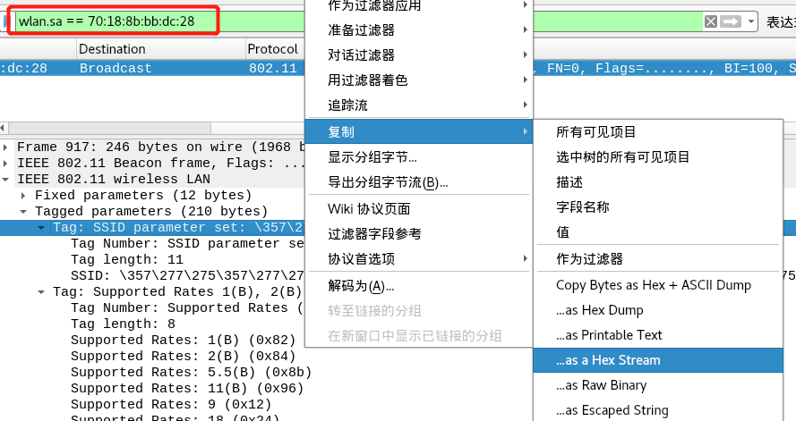

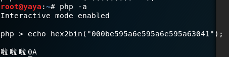

- 回复了Probe Response的AP的SSID是独立的SSID。

 
``` bash

$ tshark -r 20180922-01.cap -Y wlan.fc.type_subtype==5 -T fields -e wlan.sa -e wlan.ssid | cat -v | sort -u > proresponse01.list

$ tshark -r 20180923-03.cap -Y wlan.fc.type_subtype==5 -T fields -e wlan.sa -e wlan.ssid | cat -v | sort -u > proresponse03.list

```
1. proresponse01.list

``` bash

0c:da:41:04:4a:b0	ChinaNet
30:99:35:6a:31:69	CU_E37p
80:f6:2e:dc:63:f0	ChinaNet
9c:6f:52:6d:ee:c9	CU_H44H
9c:6f:52:6d:ef:50	CU_t4Qd
9c:6f:52:6e:20:a3	CU_DTxK
9c:6f:52:6e:22:5c	CU_PqqT
9c:6f:52:6f:05:4b	CU_fPqv
a2:ed:2c:7a:4b:a1	iPhone (37)
c8:64:c7:23:57:55	CMCC-WEB
da:64:c7:23:57:55	CMCC
ea:64:c7:23:57:55	and-Business

```

2. proresponse03.list

``` bash 
00:27:1d:04:8b:2b	CMCC-WEB
00:27:1d:04:91:63	CMCC-WEB
00:27:1d:04:9d:e1	CMCC-WEB
00:27:1d:04:a6:2b	CMCC-WEB
00:27:1d:05:8b:2b	CMCC
00:27:1d:05:91:63	CMCC
00:27:1d:05:9b:b9	CMCC
00:27:1d:05:9d:e1	CMCC
00:27:1d:05:a6:2b	CMCC
00:27:1d:06:8b:2b	and-Business
00:27:1d:06:91:63	and-Business
06:74:9c:96:d0:57	CUC-Guest
06:74:9c:96:d0:93	CUC-Guest
06:74:9c:96:d0:d9	CUC-Guest
06:74:9c:97:66:11	CUC-Guest
06:74:9c:97:74:ad	CUC-Guest
06:74:9c:97:74:d5	CUC-Guest
06:74:9c:97:74:f3	CUC-Guest
06:74:9c:97:75:1b	CUC-Guest
06:74:9c:97:75:75	CUC-Guest
0a:74:9c:96:ce:fe	CUC-WiFi
0a:74:9c:96:d0:57	CUC-WiFi
0a:74:9c:96:d0:93	CUC-WiFi
0a:74:9c:96:d0:d9	CUC-WiFi
0a:74:9c:97:66:11	CUC-WiFi
0a:74:9c:97:66:a2	CUC-WiFi
0a:74:9c:97:74:99	CUC-WiFi
0a:74:9c:97:74:ad	CUC-WiFi
0a:74:9c:97:74:cb	CUC-WiFi
0a:74:9c:97:74:d5	CUC-WiFi
0a:74:9c:97:74:f3	CUC-WiFi
0a:74:9c:97:75:1b	CUC-WiFi
0a:74:9c:97:75:70	CUC-WiFi
5e:a0:67:3b:31:ef	Mayday
9c:a5:c0:21:76:e4	vivo X6S A
a2:ed:2c:7a:4b:a1	iPhone
ac:07:5f:4f:7c:c7	HUAWEI P20
f4:ec:38:22:e9:08	chubanshe

```
- 将两个列表中的SSID进行合并，同名SSID只取一个.

``` bash
$ sort -m proresponse01.list beacon01.list | sort -k2 -u > ssid01.list

# -m 合并文件，不排序

# -k2 -u 根据第三列的值进行合并去重
```

1. ssid01.list
``` bash
0c:da:41:04:4a:b0	ChinaNet
30:99:35:6a:31:69	CU_E37p
80:f6:2e:dc:63:f0	ChinaNet
9c:6f:52:6d:ee:c9	CU_H44H
9c:6f:52:6d:ef:50	CU_t4Qd
9c:6f:52:6e:20:a3	CU_DTxK
9c:6f:52:6e:22:5c	CU_PqqT
9c:6f:52:6f:05:4b	CU_fPqv
a2:ed:2c:7a:4b:a1	iPhone (37)
c8:64:c7:23:57:55	CMCC-WEB
da:64:c7:23:57:55	CMCC
ea:64:c7:23:57:55	and-Business

```

2. ssid03.list

``` bash
70:af:6a:f0:00:59	360WiFi
00:27:1d:06:8b:2b	and-Business
f4:ec:38:22:e9:08	chubanshe
00:27:1d:05:8b:2b	CMCC
00:27:1d:04:8b:2b	CMCC-WEB
06:74:9c:96:ce:5e	CUC-Guest
0a:74:9c:96:ce:5e	CUC-WiFi
ac:07:5f:4f:7c:c7	HUAWEI P20
a2:ed:2c:7a:4b:a1	iPhone
5e:a0:67:3b:31:ef	Mayday
70:18:8b:bb:dc:28	M-oM-?M-=M-oM-?M-=M-oM-?M-=M-oM-?M-=M-oM-?M-=M-oM-?M-=M-oM-?M-=M-oM-?M-=M-oM-?M-=0A   # 啦啦啦0A
62:f1:89:e0:dc:5e	SM-G9350
9c:a5:c0:21:76:e4	vivo X6S A
de:b0:da:f9:45:4f	WIFI

```
- 经统计，01.cap有20个独立的SSID，03.cap有14个独立的SSID。

  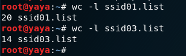

- 隐藏的SSID。不广播Beacon只回复Probe Response或广播Beacon但SSID为空（或者由若干\x00组成）的，可以被认为是隐藏SSID。
  - 通过比对可以发现，在01.cap中，既没有不广播Beacon只回复Probe Response，也没有广播Beacon但SSID为空（或者由若干\x00组成）的。所以01.cap中不存在隐藏的SSID。
  - 在03.cap中，没有广播Beacon但SSID为空（或者由若干\x00组成）的，但有不广播Beacon只回复Probe Response。所以有一个隐藏的SSID。
  

``` bash
f4:ec:38:22:e9:08	chubanshe

```


#### 2. 哪些无线热点是加密/非加密的？加密方式是否可知？

- 判断是否加密根据wlan.fixed.capabilities.privacy判断，0为非加密，1为加密。


``` bash
$ tshark -r 20180923-03.cap -Y wlan.fc.type_subtype -T fields -e wlan.sa -e wlan.fixed.capabilities.privacy -e wlan.ssid | sort -d -k2 -u

```

- 01.cap（03.cap类似，就不重复说明）

``` bash
92:1a:a9:c1:f8:7e	0	and-Business
80:f6:2e:dc:63:f0	0	ChinaNet
92:1a:a9:c1:f8:7c	0	CMCC-EDU
c8:64:c7:23:57:55	0	CMCC-WEB
92:1a:a9:c1:f8:7d	0	CUC
e4:d3:32:91:fa:b0	1	505
da:64:c7:23:57:55	1	CMCC
9c:6f:52:6e:1c:11	1	CU_2QTQ
9c:6f:52:6e:20:a3	1	CU_DTxK
30:99:35:6a:31:69	1	CU_E37p
9c:6f:52:6e:b9:d9	1	CU_ekEX
9c:6f:52:6f:05:4b	1	CU_fPqv
9c:6f:52:6d:ee:c9	1	CU_H44H
9c:6f:52:6e:22:5c	1	CU_PqqT
9c:6f:52:6e:67:7a	1	CU_QdUZ
9c:6f:52:6d:ef:50	1	CU_t4Qd
9c:6f:52:6e:ba:45	1	CU_tqRE
9c:6f:52:6e:6d:3e	1	CU_YGsD
a2:ed:2c:7a:4b:a1	1	iPhone (37)
94:d9:b3:ca:82:ee	1	TP-LINK_82EE
94:92:bc:dd:d3:43		360WiFi

```

- 加密方式根据wlan.fixed.auth.alg判断 ，0 OpenSystem / 1 SharedKey 

- 03.cap

``` bash

$ tshark -r 20180923-03.cap -Y wlan.fixed.auth.alg -T fields -e wlan.sa -e wlan.fixed.auth.alg | sort -d -u

```
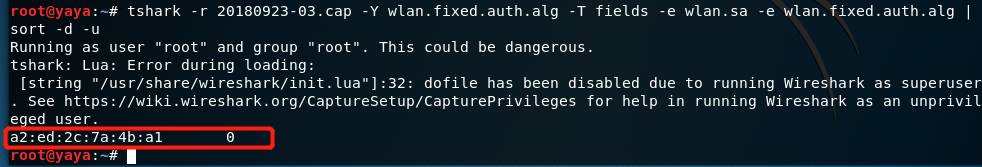

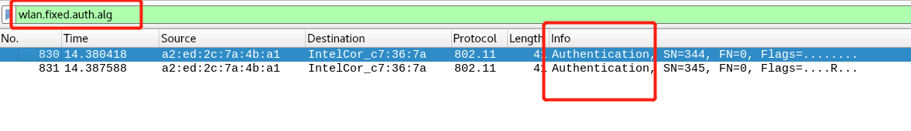


- 在抓包的过程中，只有IPhone这个热点与STA进行了身份认证，加密方式为0.(01.cap中没有认证帧，我认为在抓包的过程中，有人通过输入密码的方式连接加密的无线热点，才会有认证帧的出现，如果是自动连接，那就不会有认证的过程，所以很难抓到认证帧。)


#### 3. 如何分析出一个指定手机在抓包时间窗口内在手机端的无线网络列表可以看到哪些SSID？这台手机尝试连接了哪些SSID？最终加入了哪些SSID？

- 当收到了AP广播的Beacon帧且SSID不为空时，指定手机才能在无线网络列表中看到该SSID。

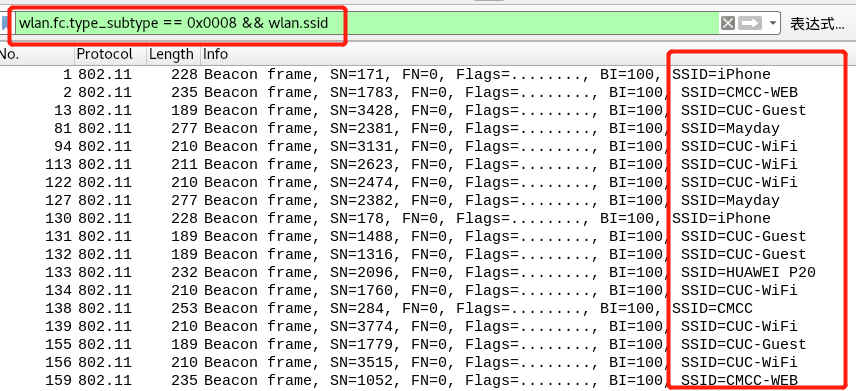

- 手机尝试连接无线热点时，会广播Probe Request帧。这样就知道这台手机尝试连接了哪些SSID。

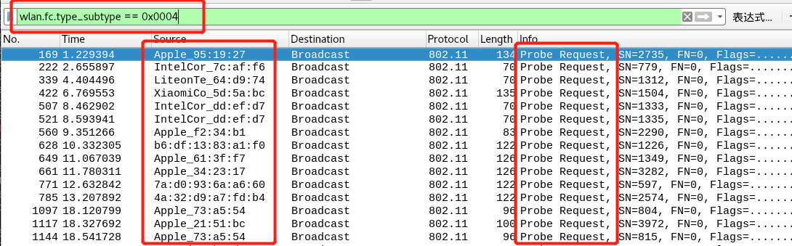

- 最终通过Association Response可以判断这台手机最终加入了哪些SSID。

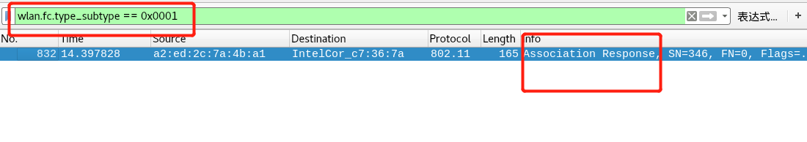

#### 4. SSID包含在哪些类型的802.11帧？

  1. Beacon frame

  2. Probe Response

  3. Probe Request

  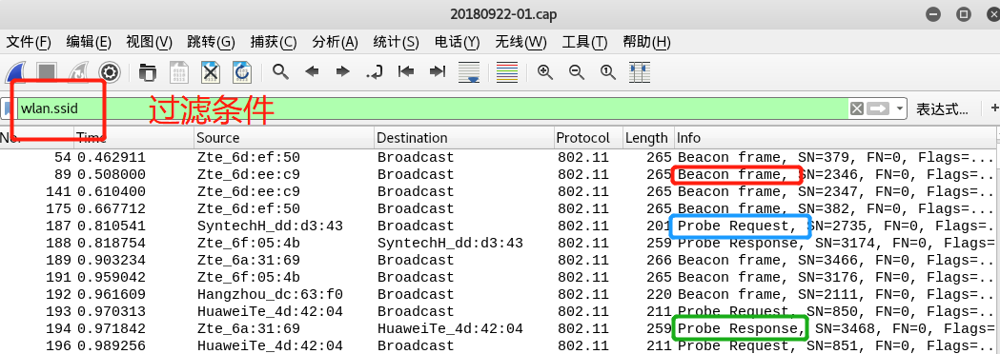


