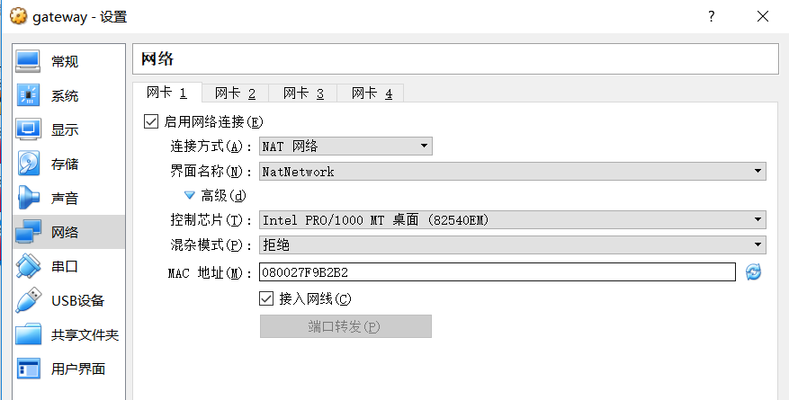
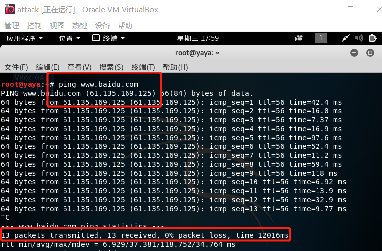

## 一. 实验要求

- 节点：靶机、网关、攻击者主机
- 连通性
  - 靶机可以直接访问攻击者主机
  - 攻击者主机无法直接访问靶机
  - 网关可以直接访问攻击者主机和靶机
  - 靶机的所有对外上下行流量必须经过网关
  - 所有节点均可以访问互联网
- 其他要求
  - 所有节点制作成基础镜像（多重加载的虚拟硬盘）

- 网络拓扑图：


## 二. 环境配置

- 所有节点制作成基础镜像（多重加载的虚拟硬盘）
  1. 选择已经安装好操作系统的attack虚拟机，在 *设置 -> 存储 -> 存储器:SATA* 中可以看到VDI类型为普通。
  
  
  2. 在 *管理 -> 虚拟介质管理* 中，选择attack.vdi，释放虚拟介质，然后将类型修改为多重加载，保存。
  
  

  3.  在 *设置 -> 存储 -> 存储器:SATA* 中，重新添加已经修改完的attack.vdi，可以看到VDI类型已经变成多重加载。
  
  

  4. 然后新建target和gateway虚拟机，在添加虚拟硬盘时，选择

- 节点 (安有kali-linux-2018.3-amd64.iso镜像的操作系统)

  1. 靶机：target。

  2. 网关：gateway。

  3. 攻击者主机：attack。


## 三. 实验过程

- 网卡设置
  1. target：一块网卡，设置为Host-Only模式。
  
  

  2. gateway：两块网卡，eth0设置为NAT 网络模式，eth1设置为Host-Only模式。
  
 
 
  
  3. attack：一块网卡，设置为NAT 网络模式。
  
 

**注：attack和gateway处于同一外网下，gateway和target处于内网下。**

- 配置并查看ip
```
$ ifconfig

```


   1. target：有一块Host-Only网卡，在全局设定中手动配置ip。
   
   

   

   2. gateway：eth0为NAT Network网卡，用dhcp动态分配ip地址；eth1为Host-Only网卡，在全局设定中手动配置ip。（上一步配置过了，这里不需要重复配置）
   

   

   3. attack：因为attack只有一块NAT Network网卡，所以只需用dhcp动态分配ip地址。
  
   


- 让靶机可以ping通攻击者主机
  1. 在target中ping attack（10.0.2.4）
  
   

  2. 在attack中监听。发现有request包，还有reply包。
  
  

  3. 但是在gateway中监听。发现只有request包，并没有attack发的reply包。
  
```
$ tcpdump -n -i eth0 icmp
$ tcpdump -n -i eth1 icmp
```
    
     
   
   从这可以看出，attack的网络中没有192.168.107.1这个IP地址，他的reply包没有发给网关，所以target无法ping通attack。

  4. 为了使target可以ping通attack，配置转发规则iptables。先查看gateway默认关于NAT的设置情况。
  
   

   然后配置：
   
``` bash

$ iptables -t nat -A POSTROUTING -o eth0 -s 192.168.107.0/24 -j MASQUERADE

$ iptables-save

```

   

   再次查看NAT表，看到已经有了刚才配置的规则。
   
   

  5. 再次让target尝试ping通attack。
  
  

  成功。再看一下监听到的数据包的情况。
  
  
  
  
  
  在gateway中，我们可以看到：网关把转发出去的包源IP替换成自己的IP。
   
  
- 为了使target可以上网（host-only），有两种解决办法：

  1. 在gateway中安装dns服务器
  

```
$ apt install dnsmasq
$ service dnsmasp start

```
  可以看到：
  
  

然后将target中的nameserver改为gateway的IP地址，即可访问。
   
- 
  2. 将target的域名服务器配置为202.205.16.4.
  
```
$ vim /etc/resolv.conf

nameserver 202.205.16.4

```

  


  
   
## 四. 实验结果
1. 靶机可以直接访问攻击者主机

   
2. 攻击者主机无法直接访问靶机


   
   
 - 从这我们可以看到，attack ping192.168.107.1时，是可以ping通的。
   
   
   

   
- 但是我们通过监听gateway，发现并没有流量通过，监听target，发现request包的ip地址是宿主机的ip地址，说明刚刚attack ping的192.168.107.1是通过宿主机ping的（因为target设置的是host-only网卡模式）。说明攻击者主机无法直接ping通靶机。


3. 网关可以直接访问攻击者主机和靶机
    1. 网关可以直接访问攻击者主机
  
    2. 网关可以直接访问靶机
  
  

4. 靶机的所有对外上下行流量必须经过网关
    
 

- 监听网关，可以看到流量情况。
  
 


5. 所有节点均可访问互联网
    1. attack:
     
    

    2. gateway:
    
    
    
    3. target:(这里成功联网之前有一个问题，会在下面说到)
    
    

## 五. 实验中遇到的问题
1. kali-linux安装增强功能时，无法定位软件包的位置。

解决办法： 在 /etc/apt/sources.list下添加官方源：

``` bash
deb http://http.kali.org/kali kali-rolling main contrib non-free

```
然后执行以下语句：

``` bash
$ apt-get update
$ apt-get install -y virtualbox-guest-x11
$ reboot

```


2. gateway的两块网卡只能连接上一块。
解决办法： 在终端执行以下内容：

``` bash

cat << EOF >> /etc/network/interfaces
allow-hotplug eth0
iface eth0 inet dhcp

allow-hotplug eth1
iface eth1 inet dhcp
EOF

systemctl restart networking
```

3. 当靶机ping攻击者主机时，gateway无法转发来自靶机的数据包。

 
 
 从上图可以看到，外网网卡监听时无响应。外网网卡没有将靶机发来的request请求发给攻击者主机。
 
 解决办法： 导致这个问题出现的原因是因为内核没有开启ipv4转发。
 在命令行输入以下命令即可解决：
 
``` bash
$ echo 1 > /proc/sys/net/ipv4/ip_forward

```

4. 靶机（host-only）模式无法通过域名访问互联网。
原因：查看iptables，发现有很长一段ufw的列表。

 

在实验进行到这一步之前，应该是开启了ufw，所以dns转发出现了问题。

解决办法：执行下列语句关闭ufw即可。

```
$ systenctl ufw disable
$ systenctl stop disable   //这里已经关闭了ufw，但是列表中还会有空规则。
$ iptables-save -c > iptables.rules
$ vi iptables.rules   //在这里删除掉空规则
$ iptables-restore < iptables.rules

```
查看iptables列表，发现已经没有ufw了。


