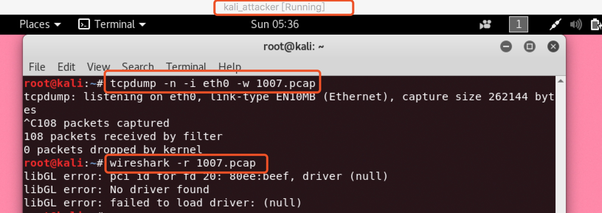

## ARP欺骗实验

### 一. 实验环境

#### 1. 网络拓扑图


#### 2. 查看ip

- Attacker：


- Gateway：


- Vitcim：


#### 3. 查看arp表

- Attacker：


- Gateway：


- Vitcim：


从arp表中可以看出攻击者，网关，靶机可以两两ping通。

### 二. arp欺骗过程

#### 1. arpspoof

- 开始前首先确定Vitcim可以上网。


- 在Attacker中使用arpspoof。


``` bash
arpspoof -i eth0 -t 192.168.107.1 192.168.107.4

# 其中192.168.107.1是Vitcim的IP地址，192.168.107.4是Vitcim的网关。
```

- 这时看到出现以下响应说明已经开始对Vitcim进行arp欺骗：


- 这时候Vitcim已经无法ping通互联网了。


- 查看Vitcim的arp表，发现有两个IP地址不同，但MAC地址相同的数据。


#### 2. 抓包分析

- 在Attacker进行arp欺骗时，在Vitcim中试图访问互联网，然后在Attacker中进行监听，抓包。从wireshark中可以看到抓包结果：Attacker中已经收到Vitcim的DNS请求。




### 三. 利用arp欺骗进行中间人攻击

#### 1. 先开启Attacker的转发功能。以便将劫持来的流量转发出去。


``` bash
echo 1 > /proc/sys/net/ipv4/ip_forward
```

#### 2. 在上一过程中，只实现了让靶机断网的目的，这里要监听靶机的的上网流量，并在其中劫持一定的登录信息，以达到中间人攻击的目的，所以在这里同时也要对网关进行arp欺骗。

``` bash

# 对靶机进行arp欺骗
arpspoof -i eth0 -t 192.168.107.1 192.168.107.4
# 对网关进行arp欺骗
arpspoof -i eth0 -t 192.168.107.4 192.168.107.1
```

#### 3. 有了1，2步，这时候就可以监听靶机上网了。

``` bash
# 将捕获的数据包保存为pcap文件
tcpdump -n -i eth0 -w 1008.pcap
```
#### 4. 在Vitcim中通过输入账号和密码登录qq邮箱，然后暂停抓包，打开pcap文件。在过滤器中输入http.cookie contains qq.


#### 5. 随便选择一个包，打开它的TCP stream，复制其中的cookie。


#### 6. 在Attacker的火狐浏览器中打开qq邮箱，在登录界面打开浏览器自带工具modify headers，新增一条数据。如下：


#### 7. 点击start，然后刷新登录界面，发现会自动登录，不需要手工输入账号和密码。至此，中间人攻击实验成功实现。