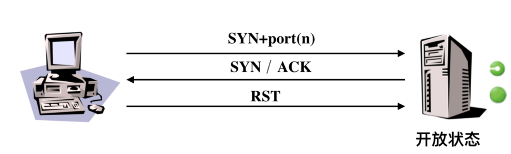
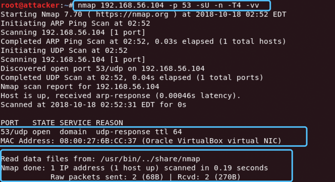

## TCP connect scan

- 实现原理：
  - connect（）
  - 完成TCP三次握手


- 编程实现（tcp_connect_scan.py）

```python
import logging
logging.getLogger("scapy.runtime").setLevel(logging.ERROR)

from scapy.all import *
dst_ip = "192.168.56.104"
src_port = RandShort()
dst_port = 80

pkt = IP(dst=dst_ip) / TCP(sport=src_port, dport=dst_port, flags="S")

pkt1 = IP(dst=dst_ip) / TCP(sport=src_port, dport=dst_port, flags="AR")
tcp_connect_scan_resp = sr1(pkt, timeout=10)

if (str(type(tcp_connect_scan_resp)) == "<type 'NoneType'>"):
    print("Closed")
elif (tcp_connect_scan_resp.haslayer(TCP)):
    if (tcp_connect_scan_resp.getlayer(TCP).flags == 0x12):
        send_rst = sr1(pkt1, timeout=10)
        print("Open")
    elif (tcp_connect_scan_resp.getlayer(TCP).flags == 0x14):
        print("Closed")

```
- 在Attacker上运行此文件。并在Victim中监听，将收到的包存进cap文件中。


- 可以看到输出为“*Closed*”，并且监听到的包只有SYN包和RST包，说明Victim的80端口是关闭状态。

- 在Victim中监听80端口后，重新发包。

``` 
nc -l -p 80
```


- 可以看到输出为“*Open*”，并且完成了三次握手。

## TCP stealth scan

- 实现原理：




- 编程实现（stealth_scan.py）

```python
import logging

logging.getLogger("scapy.runtime").setLevel(logging.ERROR)
from scapy.all import *

dst_ip = "192.168.56.104"
src_port = RandShort()
dst_port = 80

pkt = IP(dst=dst_ip) / TCP(sport=src_port, dport=dst_port, flags="S")
pkt1 = IP(dst=dst_ip) / TCP(sport=src_port, dport=dst_port, flags="R")

stealth_scan_resp = sr1(pkt, timeout=10)

if (str(type(stealth_scan_resp)) == "<type 'NoneType'>"):
    print("Filtered")
elif (stealth_scan_resp.haslayer(TCP)):
    if (stealth_scan_resp.getlayer(TCP).flags == 0x12):
        send_rst = sr(pkt1, timeout=10)
        print("Open")
    elif (stealth_scan_resp.getlayer(TCP).flags == 0x14):
        print("Closed")
elif (stealth_scan_resp.haslayer(ICMP)):
    if (int(stealth_scan_resp.getlayer(ICMP).type) == 3 and int(stealth_scan_resp.getlayer(ICMP).code) in [1, 2, 3, 9, 10, 13]):
        print("Filtered")

```
- 在Attacker上运行此文件。并在Victim中监听，将收到的包存进cap文件中。


- 可以看到输出为“*Closed*”，并且监听到的包只有SIN包和RST包，说明Victim的80端口是关闭状态。


- 在Victim中监听80端口后，重新发包。

``` 
nc -l -p  80
```


- 可以看到输出为“*Open*”。

## TCP XMAS scan
 - 实现原理：设置TCP报文头FIN、URG和PUSH标记


- 编程实现（stealth_scan.py）


```python
import logging

logging.getLogger("scapy.runtime").setLevel(logging.ERROR)
from scapy.all import *

dst_ip = "192.168.56.104"
src_port = RandShort()
dst_port = 80

pkt = IP(dst=dst_ip) / TCP(dport=dst_port, flags="FPU")

xmas_scan_resp = sr1(pkt, timeout=10)
if (str(type(xmas_scan_resp)) == "<type 'NoneType'>"):
    print("Open|Filtered")
elif (xmas_scan_resp.haslayer(TCP)):
    if (xmas_scan_resp.getlayer(TCP).flags == 0x14):
        print("Closed")
elif (xmas_scan_resp.haslayer(ICMP)):
    if (int(xmas_scan_resp.getlayer(ICMP).type) == 3 and int(xmas_scan_resp.getlayer(ICMP).code) in [1, 2, 3, 9, 10, 13]):
        print("Filtered")

```
- 在Attacker上运行此文件。并在Victim中监听，将收到的包存进cap文件中。


- 可以看到输出为“*Closed*”，并且监听到的包只有SIN包和RST包，说明Victim的80端口是关闭状态。

- 在Victim中监听80端口后，重新发包。

``` 
nc -l -p 80
```


- 可以看到输出为“*Open|Filtered*”，并且只有攻击者发送的一个UDP包，没有任何回复。

## UDP scan

- 实现原理：


- 编程实现（UDP_scan.py）


```python
import logging

logging.getLogger("scapy.runtime").setLevel(logging.ERROR)
from scapy.all import *

dst_ip = "192.168.56.104"
src_port = RandShort()
dst_port = 53
dst_timeout = 10

udp_scan_resp = sr1(IP(dst=dst_ip) / UDP(dport=dst_port), timeout=dst_timeout)
if (str(type(udp_scan_resp)) == "<type 'NoneType'>"):
    print("Open|Filtered")
elif (udp_scan_resp.haslayer(UDP)):
    print("Open")
elif (udp_scan_resp.haslayer(ICMP)):
    if (int(udp_scan_resp.getlayer(ICMP).type) == 3 and int(udp_scan_resp.getlayer(ICMP).code) == 3):
        print("Closed")
    elif (int(udp_scan_resp.getlayer(ICMP).type) == 3 and int(udp_scan_resp.getlayer(ICMP).code) in [1, 2, 9, 10, 13]):
        print("Filtered")

```

- 在Attacker上运行此文件。并在Victim中监听，将收到的包存进cap文件中。


- 可以看到输出为“*Closed*”,并且有一个UDP包和一个ICMP Error(Type 3, Code 3),说明Victim的53端口是关闭状态。


- 在Victim上监听53端口后，重新发包。

``` 
nc -u -l -p 53 
```


- 可以看到输出为“*Open/Filtered*”,并且只有攻击者发送的一个UDP包，没有任何回复。

- 但是如果修改一下nc启动参数为 ```nc -u -l -p 53 < /etc/passwd ```，然后修改 ```elif (udp_scan_resp.haslayer(UDP)): ```为 ```elif (udp_scan_resp.haslayer(UDP) or udp_scan_resp.getlayer(IP).proto == IP_PROTOS.udp):```,UDP 监听可以按照目前的扫描逻辑判断为「开放」状态。


- 查看监听到的包，可以看到Victim回复了数据。


## nmap扫描

### nmap常用参数

``` 
nmap --help

-sX： TCP XMAS scan
-sS： TCP SYN scan
-sT： TCP connect scan
-sU： UDP scan
-p：  port
-T<0-5>: Set timing template (higher is faster)
-n：  Never do DNS resolution
-A：  Enable OS detection, version detection, script scanning, and traceroute
```

### UDP scan

```
nmap 192.168.56.104 -p 53 -sU -n -T4 -vv
```

- nmap扫描```nc -ulp 53``` ,可以看到53端口显示为「关闭」状态：


- nmap扫描```nc -u -l -p 53 < /etc/passwd ```，可以看到53端口显示为「开放」状态：



 
- ```nc -ulp 53``` 监听udp/53端口，但不建立连接

- ```nc -u -l -p 53 < /etc/passwd``` 开启文件传输，发送/etc/passwd文件，因此端口是“打开”状态.

### TCP connect scan

``` 
nmap 192.168.56.104 -p 80 -sT -n -T4 -vv
```

- 「未监听」80端口。


- 「监听」80端口。


### TCP stealth scan

``` 
nmap 192.168.56.104 -p 80 -sS -n -T4 -vv
```

- 「未监听」80端口。


- 「监听」80端口。


### TCP XMAS scan

``` 
nmap 192.168.56.104 -p 80 -sX -n -T4 -vv
```

- 「未监听」80端口。


- 「监听」80端口。


- nmap的端口扫描结果和scapy编程结果相同。