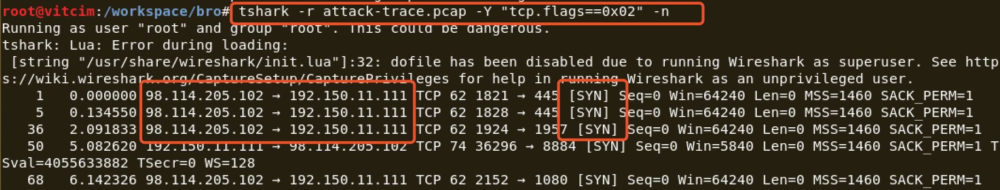

# chap0x12 实战Bro网络入侵取证

## 实验内容

使用bro来完成的对pcap包的取证分析。

## 实验环境

#### 安装bro

```
apt-get install bro bro-aux
```

#### 查看bro的基本信息

```
lsb_release -a   # 查看系统版本信息
```


```
uname -a    # 查看系统名
```


```
bro -v   # 查看bro版本信息
```


## 实验过程

#### 编辑bro配置文件。

- 编辑 ```/etc/bro/site/local.bro```

  ```
  vim /etc/bro/site/local.bro
  # 在文件尾部追加两行新配置代码
  @load frameworks/files/extract-all-files
  @load mytuning.bro
  ```

  

- 在```/etc/bro/site/```目录下创建新文件mytuning.bro

  ```
  vim /etc/bro/site/mytuning.bro
  
  # 添加以下内容
  redef ignore_checksums = T;
  ```

  


####  使用bro自动化分析pcap文件

- 下载 attack-trace.pcap 包文件。

  ```
  cd /workspace/bro
  wget https://sec.cuc.edu.cn/huangwei/textbook/ns/chap0x12/attack-trace.pcap
  ```

- 使用bro进行分析。

  ```
  bro -r attack-trace.pcap /etc/bro/site/local.bro
  ```

  

- 查看当前目录下的文件。

  

- 发现上述bro指令会产生警告信息，但是对本次实验没有影响。可以编辑`mytuning.bro`来解决警告问题。

  ```
  # 增加一行定义
  redef Site::local_nets = { 192.150.11.0/24 };
  ```

- 在执行bro语句，当前目录下的文件会增加`known_services.log`和`known_hosts.log` 。

  

- 查看extract_files目录下的文件

  

- 将该文件上传到[virustotal](https://virustotal.com/)我们会发现匹配了一个历史扫描报告。该报告表明这是一个已知的后门程序。

  

  

- 通过阅读`/usr/share/bro/base/files/extract/main.bro`的源代码，寻找入侵线索。

  

  可以看出，**文件名的最后一个-右侧的字符串FHUsSu3rWdP07eRE4l是files.log中文件的唯一标识**。

- 查看`files.log` ，发现该文件提取自网络会话标识（bro根据IP五元组计算出的一个会话唯一性散列值）为`CJuzsv2T4ZAhMpkKwK`的FTP会话。

  

- 查看`conn.log`，找到对应的IP五元组信息。

  

- 通过`conn.log`的会话标识匹配，我们发现该PE文件来自于IPv4地址为：`98.114.205.102`的主机。

### 用Wireshark和tshark对pcap包进行分析

- 查看在此次安全事件中所涉及到的ip地址。

  ```
  # -z 设置统计参数
  # -q 只在结束捕获时输出数据，针对于统计类的命令非常有用
  # -n 禁止网络对象名称解析
  tshark -r attack-trace.pcap -z ip_hosts,tree -qn
  ```

  

  

- 查看攻击者（谁主动发起的网络连接）

  ```
  tshark -r attack-trace.pcap -Y "tcp.flags==0x02" -n
  ```

  

- 查看攻击时间（攻击时间 < 抓包时间），攻击时间<16s

  ```
  capinfos attack-trace.pcap
  ```

  

- 查看TCP会话信息。

  ```
  tshark -r attack-trace.pcap -qnz conv,tcp
  ```

  

### 参考链接

1. [chap12.计算机取证实验](https://sec.cuc.edu.cn/huangwei/textbook/ns/chap0x12/exp.html)

2. [nsLecture0x12.pdf](http://sec.cuc.edu.cn/huangwei/course/2016/nsLecture0x12.pdf) 58—61页。

3. [https://github.com/CUCCS/2018-NS-Public-Lyc-heng/blob/ns_chap0x12/ns_chap0x12/实验报告.md](https://github.com/CUCCS/2018-NS-Public-Lyc-heng/blob/ns_chap0x12/ns_chap0x12/实验报告.md)
